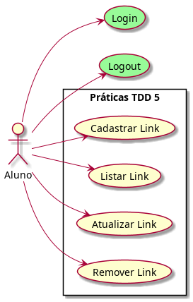
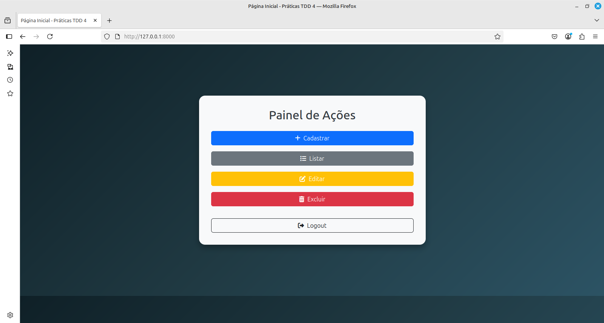
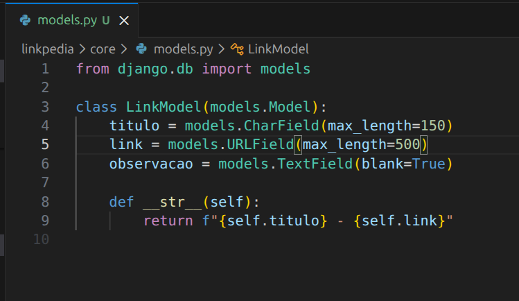
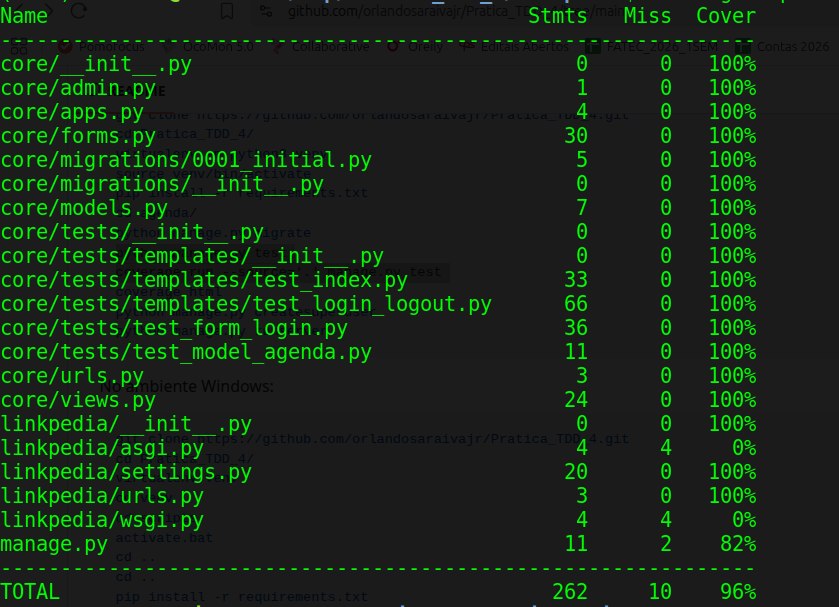

# Prática TDD 5

Desafio técnico para os alunos da disciplina "Desenvolvimento Web 3"


No ambiente Linux:

```console
git clone https://github.com/orlandosaraivajr/Pratica_TDD_5.git
cd Pratica_TDD_5/
virtualenv -p python3 venv
source venv/bin/activate
pip install -r requirements.txt
cd linkpedia/
python manage.py migrate
python manage.py test
coverage run --source='.' manage.py test 
coverage html
python manage.py createsuperuser
python manage.py runserver
```

No ambiente Windows:

```console
git clone https://github.com/orlandosaraivajr/Pratica_TDD_5.git
cd Pratica_TDD_5/
virtualenv venv
cd venv
cd scripts
activate.bat
cd ..
cd ..
pip install -r requirements.txt
cd linkpedia/
python manage.py migrate
python manage.py test
coverage run --source='.' manage.py test 
coverage html
python manage.py createsuperuser
python manage.py runserver

```

Crie um superusuário com as seguintes credenciais:

- Username <b>aluno</b>:
- E-mail address: <b>seu e-mail institucional</b>
- Password: <b>fatec</b>

### Requisitos da Sprint 1



A expectativa do projeto é que tenha-se um cadastro de links. O que foi priorizado na primeira sprint foi o sistema de login/logout.
O login somente pode ocorrer com o e-mail institucional @cps.sp.gov.br 


Imagem 1: Tela de Login



Imagem 2: Tela index


Imagem 3: Tela logout

## Requisitos para a Sprint 2

Agora começa o seu desafio: desenvolver um cadastro de links com as operações de CRUD.

Com base no modelo implementado (ver imagem abaixo), você deve:



✅ Criar um formulário para o modelo LinkModel (pode usar Forms ou ModelForms);

Implementar as seguintes funcionalidades:

✅ Cadastrar contato

✅ Listar contatos

✅ Atualizar contato

✅ Remover contato

Proteger todas essas funcionalidades para que apenas usuários logados tenham acesso.

Ao final da Sprint 2, o sistema deverá conter um CRUD funcional de links em Django.


## Ajustes nos testes / novos testes

O código fonte passará por atualizações para acomodar estes novos requisitos. Com isso, você deve ajudar os testes existentes e criar novos testes.

Você recebeu a sprint 1 com uma cobertura de teste acima de 90%. É esperado que ao final da sprint 2 a cobertura mantenha-se neste patamar.

